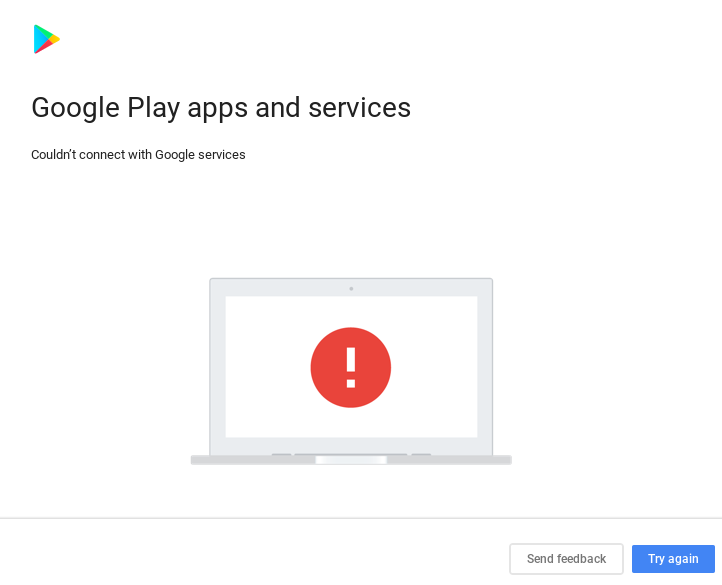
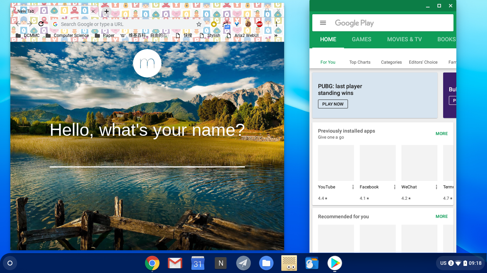
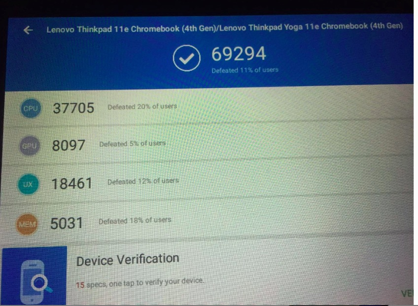
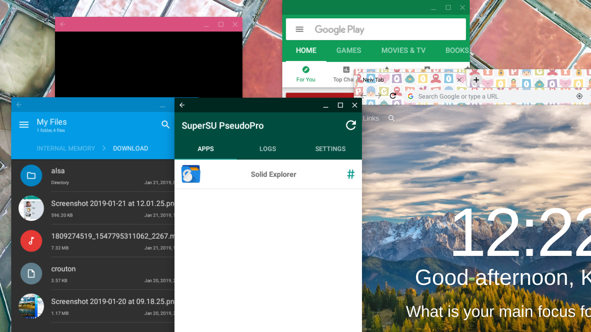
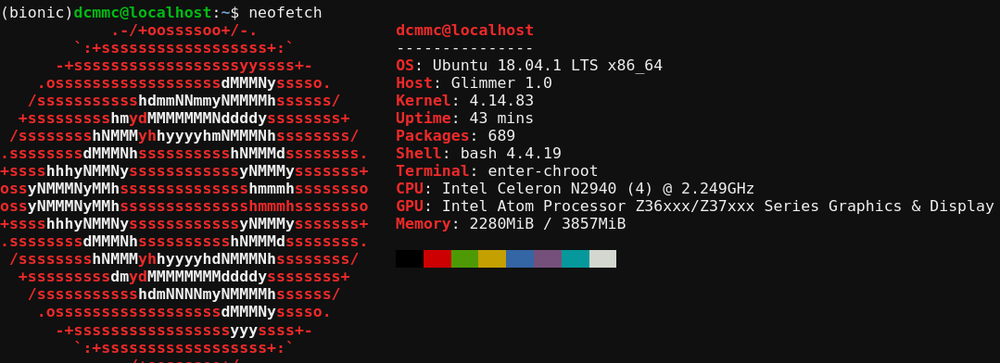
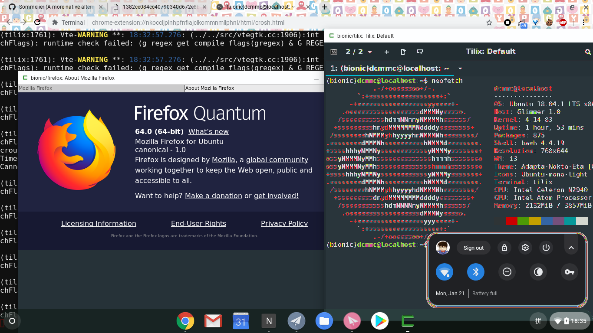
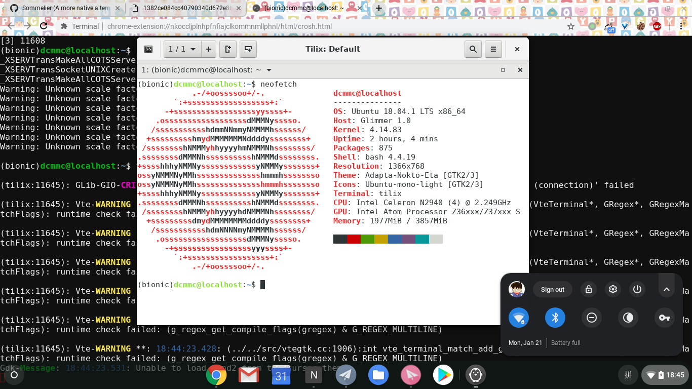

# 起因

前段时间在知乎上看到 `立党` 发的一个关于 `Chromebook` 的回答, 据说 `Chromebook` 续航久, 重量轻, 性能凑合, 价格便宜, 还是 `Linux` 家族的 `chromeOS`. 本来对 `Chrome OS` 也有点兴趣🤔, 于是乎在咸鱼入手了一台 2014 年的 `Lenovo Thinkpad E11 Chromebook` (1st gen.). 配置如下:

* 11.6 寸 720P(1366 x 768) 分辨率 `IPS` 十点触摸屏
* 16GB eMMC
* 4GB DDR3L 1333MHz RAM
* Intel 赛扬 N2940 四核 1.92~2.25 GHz CPU (BayTrail 平台, 阉割了 `vmx` 指令集)
* Intel 核显 (很差的性能, 好像用的是 Atom 系列的)

到手之后测试了一下, 续航大概 `5hrs`, 原本标称 `10hrs`, 而且我特意选了太电池损耗差不多为 `0` 的本子. 不过重量和键盘都很满意, 最重要的是: 又多个台可以折腾的机器 :). 万恶的闭源 Chrome OS 对安卓的支持在这台本子上一直是 `Plan` 状态 (其实就是 `unsupport`), 其实在硬件上是可以跑安卓子系统的 (原理后面介绍), 只不过因为机器比较老, 按照 Google 的 `EndOfLife` 计划, 2019 年中就要停止对这台机器的支持了.

# 安装 (chromefy)

因为直接用原生的 Chrome OS 没办法用安卓子系统, Google 了一番之后, `Github` 上有一个项目 [chromefy](https://github.com/imperador/chromefy), 可以把开源的 `ChromiumOS` (开源的 `Chromium OS` 没有安卓子系统, 没有 `Cronsini`, 驱动支持不好, 缺少 Chrome OS 专属软件) 在保留内核及其驱动模块的基础上, 使用 `chromeOS` 的系统分区的内容. 基本原理很简单, 不过 Chrome OS 严格使用 `tpm` 芯片来加密文件系统, 我的设备只有 `tpm1` 芯片, 如果我用了 `tpm2` 的设备的系统作为系统分区的内容, 我还需要一个 `tpm1` 设备恢复镜像用来替换其中的 `tpm2` 加密程序为 `tpm1` 的.

所以我使用以下三个镜像来进行 `chromefy`:

* `ArnoldTheBat` 的 `Special Build` 版本 ChromiumOS R72
* `pyro` (这个就是 `Thinkpad 11e Chromebook 4th gen.` ) 的 R70 恢复镜像作为系统分区内容
* `caroline` 的 R70 恢复镜像用来替换 `tpm2`

> 恢复镜像在 [这里](https://cros-updates-serving.appspot.com/) 下载.

本来用 `ArnoldTheBat` 的 R69, 我发现其内核中的驱动不支持我这台机器的屏幕旋转, 后面使用 R70 后就解决啦. Chromium OS 只提供分区布局 (Chrome/Chromium OS 的分区布局比较特殊, 很有意思, 里面准备了 两个(另加一个保留) Kernel 分区, 两个 Rootfs 分区, 用来在线更新系统, 写入到另外一个 Rootfs 和 Kernel 分区, 重启直接后切换到新系统, 以前 `小米 2SC` 手机也有这个特性, 很有意思☺️) 详情查看 [官方 Document](https://www.chromium.org/chromium-os/chromiumos-design-docs/disk-format) )

**Issues:**

* 声卡问题，我的 `11e` 的声卡是 `byt-max98090` （BayTrail 平台的），结果 `chromefy` 后 `/proc/sounds` 和 `aplay -l `都是显示的是 `chtmax98090` （CherryTrail 平台），`/usr/share/alsa/ucm` 下面没有 `chtmax98090` 的配置但有 `byt-max98090` 的, 可以用 `alsaucm` 激活其配置, 但是最终还是没有声音. 准备用 usb 声卡算了.
* 屏幕旋转时好时坏, 不过可以识别出进入平板模式, 无伤大雅吧
* 稳定性不太好，容易 freeze，估计是 GPU 驱动问题，赛扬的芯片组和 GPU 跟 `Atom` 竟然是一样的， 坑 =，=

# 激活

激活需要在 `Wifi 设置` 里面使用代理（可以用局域网内另外一台电脑开一个局域网代理), 科学上网对一个码农来说不是问题😂.

# 安卓子系统

因为型号太古老了, Google ChromeOS 并不打算为这台设备提供 `ARC++` 的支持, 不过好在折腾 Chromebook 的人还挺多的, 我很快找到了 `chromefy` 这个项目. 除了 ChromeOS, 国内的 ChromiumOS 衍生版 `FydeOS` 也可以支持安卓子系统, 不过驱动对我的机器不友好, 默认禁止 Google 账号, 默认不能使用任何 Chrome 扩展, 还有流量监控的嫌疑. 国外的 FlintOS, ArnoldTheBat, CloudReady 之类的 Chromium OS 自编译版本, 因为安卓子系统是闭源的, 受限于法律约束, 它们都不敢发布含有安卓子系统的版本. 天朝的公司倒是无视了这一点.

## `ARC++`

说起这 `++`,  那么很明显有一个 `ARC`. Chrome 以前提供过一个叫做 `ARC` 的计划，用于解决 ChromeOS 上（离线和重量级）应用匮乏的问题, 最开始的 `ARC` 计划就是

`ARC++` 的主要思路就是首先挂载一些重要的目录( `/proc`, `/storage`, `/sys` 等等), 创建好虚拟网卡, 然后使用 Linux Container 技术虚拟化一个 Android 环境 (一个完整的 Android 镜像, 见 `/opt/google/container/system.raw.img`).

> 开源的 `Anbox` 的原理跟 `ARC++` 很相似, 都是容器化一个安卓系统镜像. 不过 `Anbox` 严重依赖 `snap` (进而依赖 `systemd` ), 并且因为是开源的项目, 所以没有 `arm` 指令集翻译 (这个最开始是 `Intel` 为 `Atom` 开发的, 商业闭源的). 而 `Arc++` 是内置 `x86_64` 到 `arm` 的指令集翻译.

**`Android Container` 的文档 [在此](https://chromium.googlesource.com/chromiumos/platform2/+/master/arc/container-bundle/README.md) 还有 [这里](https://lwn.net/Articles/701964/)**

然而安卓子系统必须要点击 `Play Store` 图标初始化一次才能安装其他应用, 而这初始化, 因为安卓子系统用的是容器化技术, 网络也是隔离出来的一个虚拟网卡上的网络, 所以不会被外部的代理环境所影响. 这个 **bug** (feature) 可以参考 [chromium bugs](https://bugs.chromium.org/p/chromium/issues/detail?id=654733) 这时候就会遇到 **无法连接 Google Services** 的问题:

```
Couldn't connect with Google services.
```



Issues:

* 窗口化的应用因为 gpu 驱动问题有时候很不稳定，容易造成 crash，**全屏** 之后好很多了. 怀疑是安卓应用和 native 应用画面混成（composition）的时候驱动没实现或者不稳定.

运行 `Play Store` 效果图:



跑个分, 击败了全球 `21%` 的设备😂:



### Root 和 `Xposed`



原理也挺简单的, 主要就是挂载一下 `system.raw.img` 镜像然后写入一个 `su`, 然后更改一下 `arc++` 的挂载点配置, 做一个链接之类的. 

可以参考这里:

* [aroc](https://github.com/nolirium/aroc)
* [android-on-chrome-os-rooting](https://nolirium.blogspot.com/2016/12/android-on-chrome-os-rooting-shell.html)
* [installing-xposed-in-android-on-chrome](https://nolirium.blogspot.com/2018/04/installing-xposed-in-android-on-chrome.html)


# Crouton

> 官方出了个 `Crosini`，原理比 `Crouton` 更加复杂，`KVM` 虚拟化了一个最小 Linux 环境（包括运行了一个另外一个版本的 Linux 内核，理由是保证 chromeOS 的安全性/sandbox），然后在其上使用 Linux Kernel 的命名空间特性容器化了一个(多个） Linux 环境。因为 `N2940` 竟让把 `vmx` 指令集砍掉了（真的坑啊。。），所以 kvm 没法用。。`N3xxx` 就有 `vmx` 指令集。。。

> `KVM` 在 Linux 内核中默认不支持 `嵌套(nested) KVM 虚拟化`, 需要开启内核相关选项.

`Crouton` 就是一个 `chroot` + 自己实现了一个 `xorg server` 可以把 GUI 应用显示在 chrome tab 中的 `xiwi` + 自动挂载一些目录（tmp，~/Downloads...) + 剪贴板共享 + Audio （CARS）等等

来自 chroot 的缺陷 (弊端, 不能算 Issues):

• 因为只有 filesystem 级别的 isolate，所以进程 PID=1 已经被 chromeOS 的 `upstart` 占用而不能使用 `systemd` （可以使用容器技术解决，linux>=3.10）
• 没办法创建虚拟网卡，所以 docker 无法使用（或者说只能工作在 `net=host` 上），可以尝试用 `rtk`（也是必须 net=host）
• 内核模块需要加载的话，因为没有 `linux-header`，所以必须去 chromium project 找到当前内核使用的那个源码树的那个 commit

Issues：

• `xorg` 下 Search(Meta) 键有时候会误以为是 cap lock，有点蛋疼
• `xiwi` 下 shift 容易触发更换输入法，当时在 crouton 的应用中会识别成大写。。

安装 `ubuntu bionic(18.04.1 LTS)` 后的 `chroot` 环境:



## xiwi

`xiwi` 打开的窗口如果无法输入任何东西，请检查一下你的代理（包括扩展应用 `ss-chromeapp` 和安卓子系统中的代理开启的 VPN（会直接映射到 chromeOS），关掉代理之后就可以了。

`xiwi` 最近一次安装之后打开软件什么内容也没有，只有一片黑漆漆的内容，全屏一下就恢复了，不知道是不是新增加的 bug =，=。

Issues：

• 不能使用 chromeOS 的输入法，虽然可以键盘输入，所以需要在 Linux 中再安装一个输入法
• 截图的时候，截出来的图中类似 `Tilix` 的终端模拟器的画面会花屏，但是 sommelier 不会

弊端：

• 只能通过 chrome 扩展运行在 `tab` 里面, 虽然可以全屏, 但是系统级全局热键很影响体验, 比如 `Meta` 键默认是 `i3wm` 的修饰键, 所以最好采用 `xorg` 方式, `xorg` 和 chrome OS 的切换可以用 `shift` + `ctrl` + `alt` + `F1`/`F2`.

花屏现象, 默认会预装 `i3wm` 环境:



## sommelier

这是 `Google` 为 `Cronsini` 打造的一个将容器(或者 chroot ) 中的 `X11` 和 `Wayland` 应用重定向到 chromeOS 的 `wayland` 服务中.

这可以使得容器中的 GUI 应用更加原生地运行在 chromeOS 上。

* 没有 `GPU` 加速
* 兼容性没这么好，而且又是 wayland，稳定性就更加差了。 比如 firefox 就没法运行, wine QQ 运行也有问题。
* 一样无法使用 chromeOS 的输入法（还是安卓子系统大法好）
* 和原生窗口一模一样, 因为本身 chrome OS 的桌面就是工作在 `wayland`/`xorg` 上的, 所以比 `xiwi` 那种只能工作在 `chrome broswer tab` 里面的方式更加的自由.

效果图:



# 刷 BIOS

**TODO**

详见 [mrchromebox](https://mrchromebox.tech/#fwscript)

> 需要拆开电脑, 把主板上的一个螺丝拧下来就可以取消 `fireware write-protect`