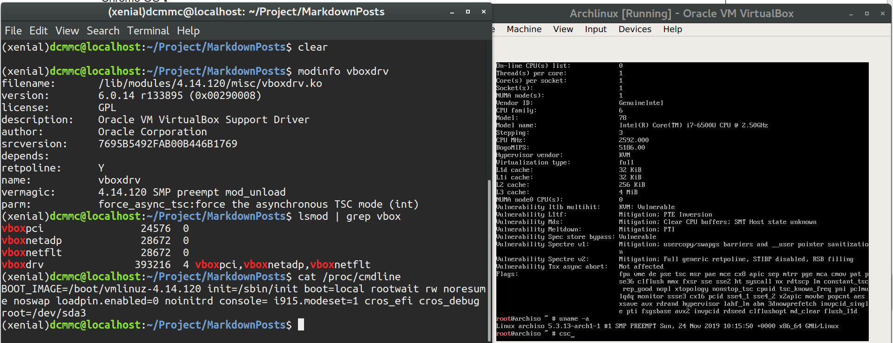
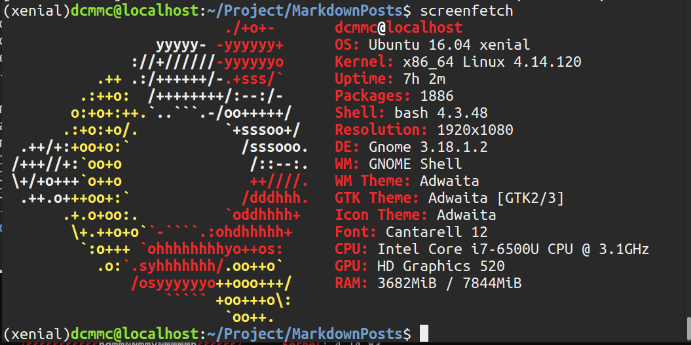
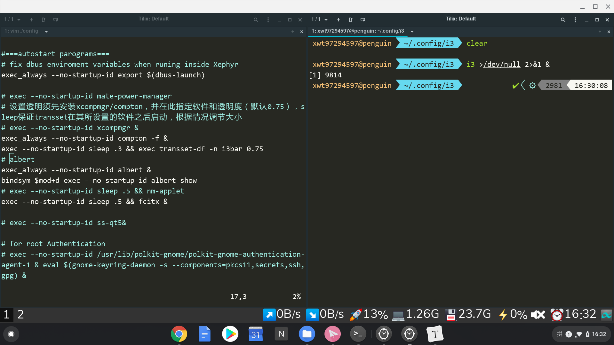

# 引子

前面提到过在旧款 chromebook 上折腾 chromefy 的故事, 最近我这里有台新的 Windows 笔记本 (HP 笔记本, 而且竟然带一个小黑点(山寨 ThinkPad 小红点)). 鉴于之前的 chromebook 没有 vmx 支持, 我准备继续在这台笔记本上折腾 Chrome OS, 主要是 crouton 和 crostini.

电脑配置如下:

```
Model: HP EliteBook 820 G3/807C
Intel Core i7-6500U CPU @ 3.1GHz
8GB DDR4
256G SSD
14 inch 1080P 屏幕
```

配置还是很不错的, 而且足够轻薄, 续航也够用.

# 多系统 (Windows)

因为 Chrome OS 的 disk partition layout 比较特殊, 所以如果 layout 不符合要求会进不去系统的.

安装多系统的思路主要是:

* 先安装 Chrome OS, 并且把 STATE 部分缩小腾出空间, 注意缩小 STATE 后需要把整个 STATE 分区格式化一次, 不然无法开机(开机自动进入修复界面, 这个东西应该是 `write_gpt.sh` 之类的东西负责检查的)
* 把 ROOT-C 或 KERNEL-C 的空间扩大 (ESP 分区我也扩大了, 原来太小了)
* 安装 Windows 到上述分区, 注意 Windows 特别喜欢重新调整分区表的顺序 (安装扇区顺序)... 打乱分区顺序后 Chrome OS 将无法进入. 直接使用 `sfdisk -d /dev/sda > sda.bkp` 暴力修改顺序再 `sfdisk /dev/sda < sda.bkp`
* 在 Windows 中可以使用 EasyUEFI 更改启动顺序或者在 BIOS 里面改

# Grub 启动问题

Chromebook 使用的是 coreboot, 并且开机加载的是 kernel blob (Partition 2 或 4 之类的, kernel blob 里面包含一个有 bootloader, kernel config 和 kernel image 的一个 device tree, 并且 blob 头会做加密校验, 内容当然也是加密的) 而不是 grub, 所以到了我这台 Windows 笔记本上只能用 grub 了.

而且我这默认 grub 的配置进不去系统, 所以需要做一下修改 (`ESP:/EFI/ChromeOS/grub.cfg` 或 `ESP:/EFI/Boot/grub.cfg`):

```
menuentry "Chrome OS" {
  insmod ext2
  insmod part_gpt
  set root=(hd0,gpt3)
  linux /boot/vmlinuz-4.14.120 init=/sbin/init boot=local rootwait ro noresume noswap loglevel=7 noinitrd console=  i915.modeset=1 dm_verity.dev_wait=0 cros_legacy cros_debug loadpin.enabled=0      root=/dev/sda3
}
```

> /dev/sda3 对应 ROOT-A 分区, 且内核参数与 Chrome OS 默认的有许多出入之处.

# Crouton

> 安装 Crouton 容器的 xorg target 需要从 google 服务器(被 gfw ban 了)下载 adhd.tar.gz, 所以如果没有解决代理需要手动下载并更改容器里面的 prepare.sh 相关内容.

`Crouton` 就是一个 `chroot` + 自己实现了一个 `xorg server` 可以把 GUI 应用显示在 chrome tab 中的 `xiwi` + 可以运行在 `freon` 的 xorg ( `frecon` 是 chromium project 做的一个 tty 终端模拟器, crouton 的 xorg 可以运行整个 desktop environment 在 tty2, 自带 gpu 加速, 甚至感觉比 chrome os 的 DE 还流畅hhh) + 自动挂载一些目录（最重要的 /var/run 用于共享 host 的 dbus 之类的东西, tmp，~/Downloads...) + 剪贴板共享 + Audio （CARS）等等

在上一篇博文中提到过 crouton 的缺陷:

> 来自 chroot 的缺陷 (弊端, 不能算 Issues):
>
> • 因为只有 filesystem 级别的 isolate，所以进程 PID=1 已经被 chromeOS 的 `upstart` 占用而不能使用 `systemd` （可以使用容器技术解决，linux>=3.10）
> • 没办法创建虚拟网卡，所以 docker 无法使用（或者说只能工作在 `net=host` 上），可以尝试用 `rtk`（也是必须 net=host）
> • 内核模块需要加载的话，因为没有 `linux-header`，所以必须去 chromium project 找到当前内核使用的那个源码树的那个 commit

折腾了一下之后发现最后只剩下 init 的问题了, init 是 upstart 不是 systemd 有点不方便.

linux-header, dkms 编译内核及其加载, kvm 和 virtualbox 的问题都搞定了.

kvm 因为 crostini 需要用到, 所以默认就有, 只不过有 `/dev/kvm` 的权限问题 (Crouton 下 `sudo` 运行然后 libvirt 用户组记得添加即可). 在更加久远之前的 Chrome OS 可能需要在 bootloader 里面加入内核启动参数 `disablevmx=off`.

测试下 kvm:

```
sudo xiwi qemu-system-x86_64 -boot d -enable-kvm -cdrom ./archlinux-2019.12.01-x86_64.iso -m 1024 -cpu kvm64 -smp 4
```

## rkt 容器的使用

```bash
sudo rkt run --no-overlay=true --insecure-options=image docker://alpine --net=host --interactive
```

> 主要是网卡只能用 `host`, `overlay` 也似乎不支持.

## linux-header 及 VirtualBox

> Chromium OS 因为稍微有点小众, 许多资料其实都已经过时了.

首先编译内核获得头文件, 这一步按照 Crouton 的 wiki 走下去就差不多了, 不过有几点需要注意的地方:

* Chromefy 后保留的是 chromium 镜像的内核, 而不是 chrome OS 恢复镜像里面的, 所以对应去 chromium os 所在版本 (e.g. 我这里是 R76, 而 chrome OS 是 R75) 对应的 Branch 去找, 记得注意小版本号和版本号里面的 git hash (如有).
* 编译内核直接使用当前内核配置: `sudo modprobe configs && zless /proc/config.gz > $KERNEL_REPO/.config`
* Chrome OS 使用比较严格的安全策略(SELinux, 禁止加载其他内核模块(文档里面说以后将可能完全禁止...)), 所以编译好的 virtualbox 内核模块会被 LoadPin 策略禁止加载 (R75 时是 LoadPin 了, 文档里面依然只有之前版本使用过的 lsm.module_locking=0 来取消禁止), 所以需要在 bootloader (i.e. grub) 里面取消该限制: `loadpin.enabled=0`

大致过程:

使用 [release-R76-12239.B-chromeos-4.14](https://chromium.googlesource.com/chromiumos/third_party/kernel/+/refs/heads/release-R76-12239.B-chromeos-4.14) 这一个 repo.

```
# repo 根目录下
./chromeos/scripts/prepareconfig chromeos-intel-pineview # 似乎可以不需要
sudo modprobe configs && zless /proc/config.gz > $KERNEL_REPO/.config
# make kernelrelease 确认下
touch REPORTING-BUGS # 缺少该文件, deb 打包会报错
sudo make-kpkg --rootcmd fakeroot kernel_image kernel_headers
```

在 Crouton 容器中修改 rc.local 使之启动的时候解除 /lib/modules 的挂载, 以免容器内对内核模块的操作影响 host:

```
#!/bin/sh -e
#
# rc.local
# umount bindmounts /lib/modules from enter-chroot
for m in `cat /proc/mounts | /usr/bin/cut -d ' ' -f2 | grep /lib/modules| grep -v "^/$" `; do
        umount "$m"
done
# try to load vboxdrv modules
if [ `find /lib/modules/"\`uname -r\`" -name vboxdrv.ko` ]; then
    # check if loadpin is disabled
    if ! grep -q "laodpin.enabled=0" /proc/cmdline; then
        exit 0
    fi
    modprobe vboxdrv
    modprobe vboxpci
    modprobe vboxnetadp
    modprobe vboxnetflt
fi
exit 0
```

Oracle VBox 在 crouton 退出时依然运行着内核模块, 需要手动卸载:

```bash
sudo /sbin/rmmod vboxpci && sudo rmmod vboxnetadp && sudo rmmod vboxnetflt && sudo rmmod vboxdrv
```

所以编译好 `linux-image.*.deb` 和  `linux-header.*.deb` 后先不要马上安装, 先确保卸载掉之前 bind mount 的 /lib/modules.

VirtualBox 效果图:



> 值得注意的是我发现也许是 `crostini` 与同样需要使用 `kvm` 的 Oracle VBox 冲突, `crostini` 所在的 `termina` 如果正在运行的话, Oracle VBox 将无法启动. 需要使用 `vmc stop termina` (在 `crosh` 中) 停止 `termina`, 而有趣的是 `qemu with kvm` 并不会与 `termina` 冲突.

## ubuntu 16.04 (xenial) 折腾记

因为 Crouton 推荐用的是 xenial (应该是支持的比较好, bug 少点), 所以就直接用用了 xenial:



Gnome 3.18 还是那个保留了 status icon bar 的版本, 真香啊, 而且没 bug 没插件的时候 Gnome 真流畅.

使用过程中遇到了点问题:

* Gnome3/GTK3 版本太老了.. `adapta-gtk-theme` 现在最低要求 gnome 3.20... 自己编译了下 (sassc 需要自己编译, [参考](https://github.com/sass/sassc/blob/master/docs/building/unix-instructions.md))发现动画没了, 画的也有问题... 所以准备用 ppa 安装一个新一点的版本的 Gnome3.

* Audio 和屏幕亮度调节有问题, 我记得 Crouton 是搞定了这些的, 到时候再折腾下.

* Gnome 开发的几个垃圾程序的 bug 导致桌面特别卡:

  * 文件索引导致的 high cpu usage: 可以去 setting 关掉, 我直接用下面的脚本屏蔽了这些扫描 ([Ref at gist](https://gist.github.com/vancluever/d34b41eb77e6d077887c))

  * 备份 (Deja) 莫名其妙 high cpu usage, 明明我是关闭的, 直接卸载: `sudo apt remove deja-dup*`

  * Gnome-software high cpu usage: 文件权限问题`sudo chown -R <USER> /home/<USER>/.cache/dconf`

    ```bash
    tracker daemon -t
    cd ~/.config/autostart
    cp -v /etc/xdg/autostart/tracker-*.desktop ./
    for FILE in tracker-*.desktop; do echo Hidden=true >> $FILE; done
    rm -rf ~/.cache/tracker ~/.local/share/tracker
    ```

> 反映出 gnome 写出来的程序真的很多 sucks 的...

# Crostini

参考 [Arch Wiki](https://wiki.archlinux.org/index.php/Chrome_OS_devices/Crostini) 安装 Archlinux 作为默认容器.

因为我现在的 Chrome OS 的版本是 R75, 到了 R77 才支持 gpu 加速, 而 R77 的 ARC 的网络代理出问题了, 而 R78 的恢复镜像当时还没出, 所以有空升级到 R78 去.

> 当时第一次进入 `Chromium OS` 的 tty 终端的时候, 发现可以用 `journal` 还以为 init 换成了 `systemd`, 结果白高兴一场, 依然是 `upstart`. 不过 `Chromium OS` 现在 (至少 R75 开始)的 tty (`frecon`) 默认是大字体了, 看着很舒服, 比 Arch Linux 默认 tty 字体大小舒服多了哈哈哈.

发现几个值得一提的事:

* Chromium project 为了增强安全性和隔离性, 所以使用 crostini 跑在 kvm (他们的 wiki 说 overhead 很小) 里面的最小化 linux 环境里面再跑 lxc 容器, 其中跑的 linux 内核是不同于 chrome os 的, 甚至更加注重安全的版本(hardended 版本).
* 只有默认容器 penguin 才能跑 sommelier
* Chrome OS 开机时默认不加载 Crostini 的, 因为 kvm 虚拟机启动还是有点费时间,以及为了安全性考虑 在 termina (Chrome OS 里面唯一能够运行的 KVM 虚拟机) 启动之前先启动  ARC 的 ss 软件, crostini 的网卡默认就会走代理了.
* crostini 出问题时 (e.g. 闪退) 万能方法: 在 Crosh (Ctrl+alt+F2 进去不要输入 shell)里面 `vsh stop termina && vsh start termina` 重启大法.
* Chrome OS 默认 iptable 规则比较严格, 局域网想访问 crostini 里面的 docker 运行的服务需要做一下端口转发 (把 host 的流量转发到容器) 并且修改 iptable 规则 (`sudo iptables -I OUTPUT -o wlan0 -j ACCEPT && sudo iptables -I INPUT -i wlan0 -j ACCEPT`).

> In a nutshell, sommelier 真香!

在 crostini 中运行完整桌面可以用 `x11docker` (配合 `weston`):

先输入`weston` 进入其桌面的终端, 输入 `x11docker --desktop --gpu --user=root --init=systemd --fullscreen x11docker/gnome`

> 在没有显卡加速的 R75 上略卡, 可以试试以后用 `chromebrew` 在 `frecon` 中使用  `weston` 来远程渲染 `crostini` 中的 `x11docker`.

## 在窗口里运行 Window Manager 或 Desktop Environment

一直有想法在运行 chrome OS 桌面的同时运行其他桌面，X11docker 是个选择不过 `weston` 效率不是很高而且 `docker` 可以理解为易失性存储器。
一次逛 Reddit 无意间发现了使用 `Xephyr` （a nested X server that runs as an X application）的 [帖子](https://www.reddit.com/r/Crostini/comments/ean9du/running_a_window_manager_i3wm_on_stock_chrome_os)，折腾了一下发现效果相当好！

```bash
alias starti3='unset DBUS_SESSION_BUS_ADDRESS && unset XDG_RUNTIME_DIR && Xephyr -br -ac -noreset -screen 1920x1080 -dpi 150 -resizeable :2 >/dev/null 2>&1 &; sleep 1s && DISPLAY=:2 i3 >/dev/null 2>&1 &'
alias exiti3='pkill Xephyr && pkill i3'
```

> 主要需要注意的就是需要创建并使用新的 D-BUS session，否则在 `i3wm` 中打开的窗口不会运行在 `i3wm` 里面而是跑出去了，因为它们依赖 DBUS，错误的使用原来的 DBUS 回话打开了窗口。所以需要在新回话之前 unset 掉所有 DBUS 有关的环境变量。

其实是在 `i3wm` 中因为缺少 DBUS 有关环境变量，会导致依赖它们的程序运行不正常（e.g. 搜狗拼音），所以需要 `export $(dbus-launch)` （可以直接放到 `~/.config/i3/config` 里面）导出一下。

其次，我发现 `crostini` 中的 `sommelier` 会劫持一部分的快捷键来匹配 chrome OS 的行为，比如 `super_L` (a.k.a. `meta`) 键，Alt+`-` (最小化窗口)，Alt+`+` （最大化窗口），Alt+`[` （左半分屏），Alt+`]` (左半分屏)，etc. 所以要想在 `i3wm` 中使用 `Alt+1` 这样的快捷键，需要修改一下 `sommelier` 配置（[参考]（https://old.reddit.com/r/Crostini/wiki/enable-chrome-shortcuts-in-linux-apps)：

```bash
mkdir -p ~/.config/systemd/user/sommelier@.service.d/
cat <<EOF > ~/.config/systemd/user/sommelier@.service.d/cros-sommelier-override.conf
[Service]
Environment="SOMMELIER_ACCELERATORS=<Alt>minus,<Alt>equal"
EOF
mkdir -p ~/.config/systemd/user/sommelier-x@.service.d/
cat <<EOF > ~/.config/systemd/user/sommelier-x@.service.d/cros-sommelier-x-override.conf
[Service]
Environment="SOMMELIER_ACCELERATORS=<Alt>minus,<Alt>equal"
EOF
```

测试 `i3wm` 的时候还是发现 `meta+1` 这样的组合键有问题，用 `xev` 测试发现 `meat+1` 识别成了 `super_L + F1`, 研究了一会儿最后决定直接把 `$mod` 改成了 `Alt` 一劳永逸hhhh。

现在还有点小问题，`F3` 全屏之后 `i3wm` 的大小还是原来的大小。

全家福：



>  不管是 `crostini` 还是 `crouton` 都可以用本小节方法在窗口中运行新的 `X server`。

# Changelog

## 2019-12-12

加入 VBox 和 Termina 冲突有关的内容, 以及 `rkt` 和 `x11docker`.
